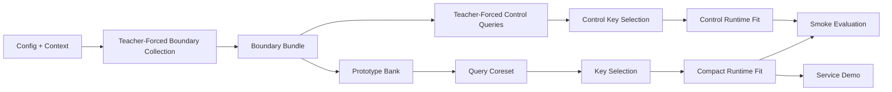

# Architecture

## Scope

`clean_repo` carries one default story:

- model: `Qwen2.5-3B`
- surface: `qwen25_smoke`
- paths:
  - full-cache reference
  - compacted sketch
  - teacher-forced subsample control

It also carries one minimal interactive path:

- `service_demo`

The code is intentionally narrower than the research repo. It keeps only the
validated path needed to reproduce the current result and demonstrate a
service-shaped compaction loop.

## Data Flow

The end-to-end path is:

1. Config and context loading
   - `config.py`
   - `context_loader.py`

2. Boundary collection
   - `boundary_collection.py`
   - teacher-forced eager prefill over the prefix
   - captures sparse query rows at fixed boundary token indices
   - materializes boundary key/value rows from the final cache

Synthetic-only helper:

- `feature_harvester.py`
  - deterministic hashed observation generator
  - kept for lightweight substrate tests and early smoke scaffolding
  - not used as the authoritative model-backed evidence path in the current
    demonstrated smoke or service runs

3. Sketch state
   - `prototype_bank.py`
   - accumulates query-conditioned observations into a small prototype bank

4. Query source extraction
   - `coreset.py`
   - extracts the sketch-derived query coreset
   - `query_controls.py`
   - derives the explicit teacher-forced control query source

5. Key selection
   - `key_selection.py`
   - supports `highest_attention` and `omp`
   - `head_budget.py`
   - resolves per-head budgets

6. Runtime fitting
   - `runtime_compaction.py`
   - fits per-head compact keys, `beta`, and compact values
   - produces the compact runtime objects used at continuation time

7. Evaluation / demo
   - `behavioral_eval.py`
   - reruns the smoke prompt surface over:
     - reference
     - sketch
     - control
   - `service_demo.py`
   - exposes the same compacted runtime through a small CLI shell

## Boundary Bundle

The most important stable interface in the clean repo is the boundary bundle:

- `harvest`
- `query_bank`
- boundary `K`
- boundary `V`
- projected boundary values
- raw output targets

That bundle is the handoff between teacher-forced evidence collection and the
rest of compaction. Everything downstream operates on that bundle rather than
reaching back into model internals.

## Design Choices

The clean repo prefers:

- eager teacher-forced boundary collection over trace-optimized collection
  because it is easier to explain and reproduce
- one prompt surface over a matrix of prompt families
- explicit controls over hidden fallbacks
- a small set of well-named modules over a single large orchestration file

The optimized service work still exists in the research repo. The clean repo
keeps the protocol and the validated story, not every optimization branch.

## Streaming Gap

The clean repo does not currently package the research repo's generation-time
streaming observer path. The validated clean artifact demonstrates:

- boundary-triggered compaction
- teacher-forced sparse boundary evidence collection
- sketch vs explicit teacher-forced control comparison

It does not yet demonstrate the research repo's separate claim that narrow
live observation during generation can run at very low overhead. That claim
remains in the research repo and should be treated as a parallel, not yet
merged, result.

## What This Repo Does Not Claim

This repo does not claim:

- that the current smoke surface is a universal benchmark
- that the clean path is the fastest possible implementation
- that all model families share the same prompt surface
- that the relational-binding failure analysis belongs in the first public path

Those remain part of the research repo or later parallel stories.
